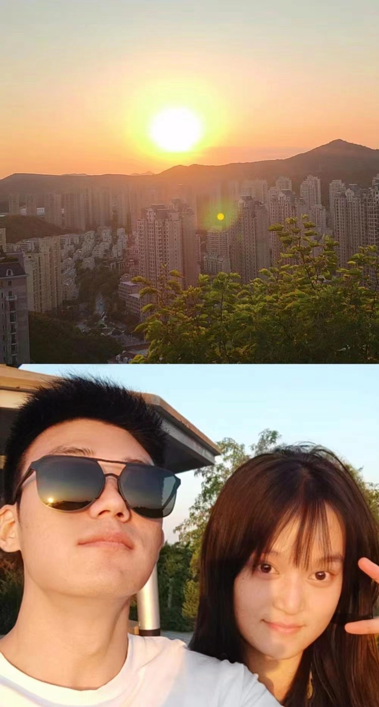

### 序

就当是一个礼物吧，

本来就不属于我。

所以失去，

我也认为是理所应当。

### 识

女明星海报是一切的缘起

她和她的室友都是有趣的灵魂

### 格

不扭捏、不矫揉造作

小男孩是我对她的评价

餐餐辣椒餐餐油

清淡是她的忌口

她是天生的段子手

脑路清奇、言语犀利

不经意间地逗得人前仰后合

>什么时候提倡吃饭不穿衣服啊！  
那像我这种又爱吃又怕死的呢？

### 历

时间不算长

仅此一个月

但却感觉过了一世纪

每天都是不一样的旅程

### 感

我曾捡到一束光，

日落时还给了太阳，

我知道那不是我的太阳，

但有一刻，阳光确实照在了我的身上。

</img>

### 因

那一段时间刚刚摆脱一段荒唐的关系，整个人失落到谷底，对感情极度悲观，写下了“我依旧相信爱情，但不相信爱情会降临在自己身上”的话。因为要完成毕业设计的原因，所以我每天过的还算充实，社交方面有小洋作伴。每天起床就是食堂、图书馆或者A7空教室，晚上回寝室看电影、打游戏、睡觉。每天生活虽然单调，但是我并不感觉无聊，我没有什么对其他新事物的强烈渴望。

我唯一一次的外出活动就是在一次偶然的机会，跟小洋临时起意地去爬了一趟山，当时看到一伙人从身边的山上下来，感觉非常好奇，他们说这上面有一座公主坟。在这里待得都要大写毕业了，也没有在周边转悠过。于是，我们就下决心爬一次。

那一次的爬行并不顺利，可以说基本没有路，两侧的树枝长出来，伸出刺来，仿佛要留下行人身上的一点什么。小洋当时跟女朋友正处于热恋期，每天煲电话粥，我已经习惯了他们的腻歪，从山下一直打到山上。我双手爬山感觉已经很费劲了，他一只手拿着手机，另一只手左薅有拽，我看他也乐在其中。

我羡慕他爬到山顶可以有人分享美景，而我只能打开外放播放喜欢的音乐。

### 缘

也许是天都看不下去让这么好的男孩如此受煎熬，那天正好指引我拍下那张照片。非常平常的一天，我起床去吃饭，在路上看到了那张很明显的海报，我感觉非常有趣，于是就拍了张照片。在食堂吃饭的时候我告诉小洋我下来的时候遇到了很有趣的事，我把照片拿给小洋看了看。他眼睛一眯，饶有兴趣地说“这个人好像是我们班的”。我大惊失色，怎么可能这么巧啊。更让我感到意外的是，小洋直接打电话去向本人确认了。

后来她得知我跟她毕业设计是一个组的，他也有点好奇这个人了。在小洋无意创造的条件下，我跟她还熟络了起来。第一次是她向小洋送零食，我陪着小洋去取，这是见的第一面。当时我饿极了，只想快点吃完饭，然后去找个空教室，抓紧做自己的毕设，所以给人的感觉就是极其不耐烦。（我也不知道当时就成为她的狩猎目标了。）

第二次见面是我和小洋已经在A7找好了空教室，然后小洋接了一个电话说：“待会有人过来找咱们。”谁知这一次见面我们便成为了微信好友。之后交流便愈发频繁，尤其是在五一假期期间，我跟她的感情迅速升温，变成了无话不说的好朋友。

她和我认识的其他人都不一样，她很洒脱随性，说起话来吊吊的。

她更多的吸引我的是她的性格，这也是她的人格魅力所在。

她比我小三岁，这是她第一次谈恋爱，我总是在告诉自己，一定要给她一段完美的恋爱，所以我尽我认知范围最大的努力去关照她。

在学校的那一段日子，我几乎天天都和她在一起。我之前对守在女寝下面的男生嗤之以鼻，对室友调侃道：“女寝楼下最多的竟然是男生，太讽刺了。”结果也躲不过真香定理。

在她寝室楼下帮她拧衣服的水；还偷偷捡了别人掉的水果吃；10点锁门9点58被她拽着去买烤肠。

---

### X

很长时间没有更新过这一篇文章了，距离我写上面的文章已经过去了两个月。这两个月发生的事情太多太多了。或许我们都没有想到我们会走到这么远，之前最糟糕的打算就是毕业就分手，但是当毕业那一天到来时我们谁也不想就这样结束。

毕业回家我们提前搬离了学校，住到了离机场近一点的旅馆，我们倒数着时间过日子，